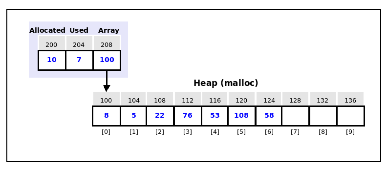

# Assignment Three - Vector Library (Integers)

## Overview

A Vector is a resizable dynamic array that store elements of the same type. Similar to an ArrayList in the Java language,  the vector dynamically expands to allow additional elements to be added to the Vector.  The vector needs to manage the size and allocation of memory to allow the addition of more elements so the programmer does not have to manage the memory for the Vector.  The Vector can be defined as a struct with three fields, the number of elements allocated, the number of elements used, and a pointer to the contiguous memory for the storage of the elements. (See figure below)



Your assignment for this problem set is to create a **reusable Vector Library** to create, manage, and manipulate **integers only**. (growable integer arrays)  The Vectors of Integers could be used in place of regular integer arrays.

## Function Descriptions

**Vector vectorNew(int size)**

Create a new Vector.  Use the size parameter to adjust the size of the initial vector.  The function should return a pointer to the newly created vector(struct).  The Vector type is the following typedef for your final struct vector.

```typdef struct vector *Vector;```

---

**void vectorDelete(Vector vector)**;

Delete the vector by freeing all dynamic memory on the heap allocated by your vector.  The parameter is a Vector type that was created by a call to vectorNew().

---

**void vectorPush(Vector \*vector, int value);**

Add a new integer, value, to the end of the vector.  If there is not enough memory allocated, this function should check and call the vectorResize() function to allocate more and add the integer to the vector. **You MUST use your vectorResize() function to resize the vector.  You cannot use the realloc() function from STDLIB.** The parameter Vector is a vector pointer created by the vectorNew() function.

---

**int \*vectorResize(Vector \*vector,int addSize);**
              
Expands the storage for the vector from the heap. This function is not called directly by the programmer, it will be called by the **vectorPush() function**.  The addSize parameter indicates how many elements(integers) to expand the storage. The parameter Vector is a vector pointer created by the vectorNew() function.

---

**void vectorStatus(Vector vector);**

This function displays the memory addresses and contents of the memory currently in use by the vector.  This is a troubleshooting tool to assist your development and testing. The parameter Vector is a vector pointer created by the vectorNew() function.

---

**int vectorPop(Vector vector);**

This function removes the last integer pushed on the vector and provides it as the return value. The parameter Vector is a vector pointer created by the vectorNew() function.

---

**int vectorGet(Vector vector,int index);**

Returns the integer from the vector at the specified index. If the index is invalid, the function returns a zero.The parameter Vector is a vector pointer created by the vectorNew() function.

---

**int vectorSet(Vector vector, int index, int value);**

Replaces the value in the vector at index with the parameter, value. The parameter Vector is a vector pointer created by the vectorNew() function. If the index is invalid, the function returns a zero.The parameter Vector is a vector pointer created by the vectorNew() function.

---

**int vectorLen(Vector vector);**

Returns the length/number of locations used in the vector.  The parameter Vector is a vector pointer created by the vectorNew() function.

---

## Assignment

1. Design and implement all of the functions in the library.
2. Write a test program/script to test your library functions.
3. Create a **Static Library version** of Vector named **libvector.a**.  Create the makefile to manage build, clean, and install the library. Place all of your directory tree under the directory, **static**.
4. Create a **Shared Library version** of Vector named **libvector.so**. Create the makefile to manage build, clean, and install the library. Place all of your directory tree under the directory, **shared**.

Your library should not have any memory leaks on the Heap.  All malloc() calls should have free() calls to deallocate the memory.  Run **valgrind** with your test program to ensure no memory leaks in the library.
